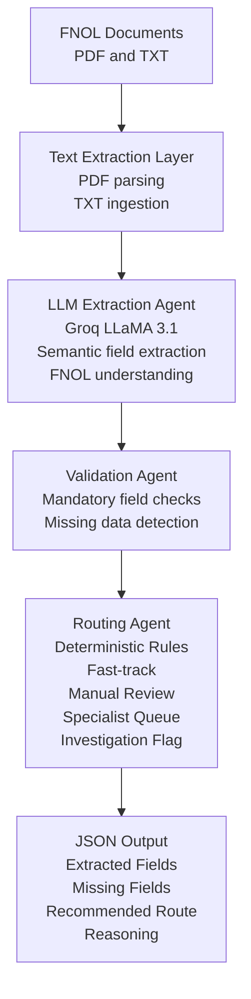

# 🧠 Autonomous Insurance Claims Processing Agent

## 📌 Overview

This project implements a **lightweight autonomous insurance claims processing agent** that automates the early stages of claim handling using AI agents and deterministic business rules.

The system ingests **FNOL (First Notice of Loss)** documents in **PDF or TXT** format, extracts key claim fields using a **Groq-hosted LLM**, validates completeness, classifies the claim, and routes it to the appropriate workflow with a **clear, explainable reason**.

The design follows real-world **agentic AI principles** while ensuring **explainability, safety, and auditability**, which are critical in insurance systems.

---

## 🎯 Problem Statement

Build an autonomous agent that can:

- Extract key fields from FNOL documents  
- Identify missing or inconsistent fields  
- Classify claims and route them to the correct workflow  
- Provide a short, explainable reason for each routing decision  

---

## 🧠 High-Level Architecture

FNOL Document (PDF / TXT)
↓
LLM-Based Extraction Agent (Groq)
↓
Validation Agent (Mandatory Field Checks)
↓
Routing Agent (Deterministic Rules)
↓
Structured JSON Output


---

## 🔑 Design Principle

- LLM is used **only for information extraction**
- All business decisions are **rule-based**
- Prevents hallucinations and ensures compliance

---

## 🧩 Features

- 📄 Supports PDF and TXT FNOL documents  
- 🤖 LLM-powered semantic extraction using Groq  
- ✅ Mandatory field validation  
- 🧭 Deterministic claim routing  
- 📝 Explainable decision output  
- 🛑 Safe handling of incomplete or blank FNOLs  

---

## 📂 Project Structure

insurance-claims-agent/
│
├── sample fnol/
│ ├── manual_review_fnol.txt
│ ├── fasttrack_fnol.txt
│ ├── injury_fnol.txt
│ ├── investigation_fnol.txt
│ └── ACORD-Automobile-Loss-Notice-12.05.16.pdf
│
├── extractor.py
├── llm_extractor.py
├── validator.py
├── router.py
├── main.py
├── requirements.txt
├── README.md
└── .env

---

## 📑 Fields Extracted from FNOL

### Policy Information
- Policy Number  
- Policyholder Name  
- Effective Dates  

### Incident Information
- Incident Date  
- Incident Time  
- Incident Location  
- Incident Description  

### Involved Parties
- Claimant  
- Third Parties  
- Contact Details  

### Asset Details
- Asset Type  
- Asset ID  
- Estimated Damage  

### Other Mandatory Fields
- Claim Type  
- Attachments  
- Initial Estimate  

---
## 🏗️ Architecture Diagram (Mermaid)



## 📌 Why This Is Excellent for Assessment

- Clearly shows **agent separation**
- Explicitly limits **LLM usage to extraction only**
- Demonstrates **deterministic, rule-based routing**
- Provides a **fully explainable and auditable pipeline**

---

## 🧠 Design Rationale

The system follows a **multi-agent architecture** where each agent has a
single responsibility. The LLM is strictly restricted to **semantic
extraction**, while validation and routing are handled using
**deterministic business logic**. This design ensures **safety,
explainability, and compliance**, which are essential requirements for
real-world insurance claim processing systems.
## 🧭 Routing Rules

| Condition | Route |
|---------|------|
| Any mandatory field missing | Manual Review |
| Estimated damage < 25,000 | Fast-track |
| Claim type = injury | Specialist Queue |
| Fraud keywords detected | Investigation Flag |

**Fraud keywords:** `fraud`, `staged`, `inconsistent`

---

## ⚙️ Setup & Installation

### 1️⃣ Clone Repository
```bash
git clone <your-repo-url>
cd insurance-claims-agent

Create Virtual Environment
python -m venv venv

```
Activate (Windows):
```
venv\Scripts\activate
```
3️⃣ Install Dependencies
```
pip install -r requirements.txt
```
4️⃣ Configure Environment Variables
```
Create a .env file in the project root:

GROQ_API_KEY=your_groq_api_key_here
```
▶️ Running the Agent (Exact Commands)

⚠️ The folder name contains a space (sample fnol), so paths must be wrapped in quotes.
```
🔹 Manual Review (Missing Fields)
python main.py "sample fnol/manual_review_fnol.txt"
```
```
🔹 Fast-track Claim
python main.py "sample fnol/fasttrack_fnol.txt"
```
```
🔹 Specialist Queue (Injury Claim)
python main.py "sample fnol/injury_fnol.txt"
```
```
🔹 Investigation Flag (Fraud Indicators)
python main.py "sample fnol/investigation_fnol.txt"
```
```
🔹 Blank ACORD PDF
python main.py "sample fnol/ACORD-Automobile-Loss-Notice-12.05.16.pdf"
```
```
📤 Output Format
{
  "extractedFields": {},
  "missingFields": [],
  "recommendedRoute": "Fast-track",
  "reasoning": "Estimated damage below 25,000."
}
```
## 🧪 Demo FNOL Files

| FNOL File | Expected Route |
|---------|---------------|
| `manual_review_fnol.txt` | Manual Review |
| `fasttrack_fnol.txt` | Fast-track |
| `injury_fnol.txt` | Specialist Queue |
| `investigation_fnol.txt` | Investigation Flag |
| Blank ACORD PDF | Manual Review |

---

## 🔐 Safety & Explainability

- LLM never makes routing decisions  
- Blank FNOLs are intentionally routed to manual review  
- All decisions are deterministic and auditable  
- Robust JSON parsing prevents silent failures  

---

## 📘 Alignment with Autonomous Claim Processing

This project aligns with modern agentic AI claim processing systems by:

- Automating FNOL data extraction  
- Performing claims triage via autonomous agents  
- Ensuring compliance through rule-based decisions  

It represents a lightweight textual counterpart to enterprise multi-agent systems such as **Akira AI**.

---

## 🚀 Future Enhancements

- OCR support for scanned PDFs  
- Vision agent for damage estimation  
- Confidence scoring  
- Batch FNOL processing  
- LangChain / LangGraph orchestration  

---

## 🎤 One-Line Summary

**A hybrid LLM + rule-based autonomous insurance claims agent that extracts FNOL data, validates completeness, and routes claims with explainable decisions.**

This solution uses a hybrid architecture:
- LLM-based extraction (Groq LLaMA 3.1) for FNOL field parsing
- Deterministic rule-based validation and routing

The LLM is restricted to extraction only.
All business decisions remain rule-driven for explainability and safety.


## Demo FNOL Files
- manual_review_fnol.txt → Missing fields → Manual Review
- fasttrack_fnol.txt → Damage < 25,000 → Fast-track
- injury_fnol.txt → Injury claim → Specialist Queue
- investigation_fnol.txt → Fraud keywords → Investigation Flag


